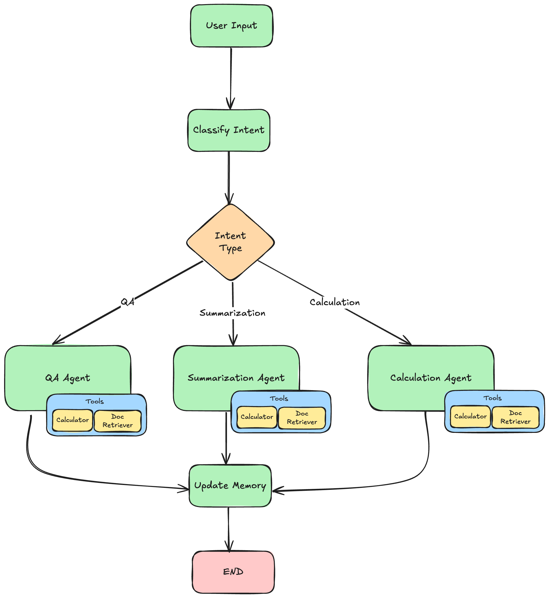

# Document Assistant Project Instructions

Welcome to the Document Assistant project! This project will help you build a sophisticated document processing system using LangChain and LangGraph. You'll create an AI assistant that can answer questions, summarize documents, and perform calculations on financial and healthcare documents.

## Project Overview

This document assistant uses a multi-agent architecture with LangGraph to handle different types of user requests:
- **Q&A Agent**: Answers specific questions about document content
- **Summarization Agent**: Creates summaries and extracts key points from documents
- **Calculation Agent**: Performs mathematical operations on document data

### Prerequisites
- Python 3.9+
- OpenAI API key

### Installation

1. Clone the repository:
```bash
cd <repository_path>
```

2. Create a virtual environment:
```bash
python -m venv venv
source venv/bin/activate  # On Windows: venv\Scripts\activate
```

3. Install dependencies:
```bash
pip install -r requirements.txt
```

4. Create a `.env` file:
```bash
cp .env.example .env
# Edit .env and add your OpenAI API key
```

### Running the Assistant

```bash
python main.py
```

## Project Structure
```
doc_assistant_project/
├── src/
│   ├── schemas.py        # Pydantic models
│   ├── retrieval.py      # Document retrieval
│   ├── tools.py          # Agent tools
│   ├── prompts.py        # Prompt templates
│   ├── agent.py          # LangGraph workflow
│   └── assistant.py      # Main agent
├── sessions/             # Saved conversation sessions
├── main.py               # Entry point
├── requirements.txt      # Dependencies
└── README.md             # This file
```


## Agent Architecture

The LangGraph agent follows this workflow:



## Implementation Tasks

### 1. Schema Implementation (schemas.py)

#### Task 1.1: AnswerResponse Schema
Create a Pydantic model for structured Q&A responses with the following fields:
- `question`: The original user question (string)
- `answer`: The generated answer (string)
- `sources`: List of source document IDs used (list of strings)
- `confidence`: Confidence score between 0 and 1 (float)
- `timestamp`: When the response was generated (datetime)

**Purpose**: This schema ensures consistent formatting of answers and tracks which documents were referenced.

#### Task 1.2: UserIntent Schema
Create a Pydantic model for intent classification with these fields:
- `intent_type`: The classified intent ("qa", "summarization", "calculation", or "unknown")
- `confidence`: Confidence in classification (float between 0 and 1)
- `reasoning`: Explanation for the classification (string)

**Purpose**: This schema helps the system understand what type of request the user is making and route it to the appropriate agent.

### 2. Agent State Implementation (agent.py, assistant.py)

#### Task 2.1: AgentState Properties
The `AgentState` class is already defined, but you need to understand its structure:
- `user_input`: Current user input
- `messages`: Conversation messages with LangGraph message annotation
- `intent`: Classified user intent
- `next_step`: Next node to execute in the graph
- `conversation_summary`: Summary of recent conversation
- `active_documents`: Document IDs currently being discussed
- `current_response`: The response being built
- `tools_used`: List of tools used in current turn
- `session_id` and `user_id`: Session management
- `actions_taken`: List of agent nodes executed (to be added in Task 2.6)

#### Task 2.2: Intent Classification Function
Implement the `classify_intent` function:
The `classify_intent` function is the first node in the graph. It just purpose to query the LLM, by providing both the user's input
and message history (if any exists) and instruct the LLM to classify the intent so that graph can direct the request to the appropriate node.
Some of the code for this function is already provided, but you need to complete it by doing the following steps:
1. Configure the `llm` to use structured output with the `UserIntent` schema
2. Create a prompt by calling the `get_intent_classification_prompt()` function from `prompts.py`.(HINT: you will need to call `format` on the returned value and pass in the `user_input` and `conversation_history`) 
3. Make sure you read the prompt on `prompts.py` to understand what input variables it expects and what it is asking the LLM to return.
4. Invoke the LLM with the prompt
5. Implement conditional logic that sets the `next_step` based on the classified `intent`:
   - "qa" --> "qa_agent"
   - "summarization" --> "summarization_agent"
   - "calculation" --> "calculation_agent"
   - default --> "qa_agent"
6. Update the state with `actions_taken = ["classify_intent"]` also include the new `intent` value and `next_step`, then return the updated state

**Key concepts**: 
- Use `llm.with_structured_output(UserIntent)` for structured responses
- The function should return a state update with `actions_taken`, `intent`, and `next_step`

#### Task 2.3: Calculation Agent Completion & Summarization Agent Completion
Take a look at the code for the `qa_agent` node in `agent.py`. Pay attention to the parameters it takes, how it retrieves and constructs the prompt, and how it enforces structured output and how it updates the state object. 
1. Implement the `calculation_agent` and `summarization_agent` functions to follow the same pattern by some function calls must be modified to accept values that are specific to the respective nodes.
2. Be sure to use properly retrieve the prompt templates
3. Take a look at the defined structured output schemas that correspond to each node and pass them to the appropriate function.
4. Make sure to return an updated state object that includes all the same fields that are updated by the `qa_agent` node.


#### Task 2.4: Complete the Update Memory Function
Complete the `update_memory` function by doing the following steps:
1. Extract the llm from the config parameter. (HINT: you may need to modify the function in order to do this)
2. Pass in the correct schema to enforce structured output
3. Updates the state with conversation_summary, active_documents, and next_step


**Purpose**: This function maintains conversation context and tracks document references across turns.

#### Task 2.5: Workflow Creation
Complete the `create_workflow` function that:
1. Adds all agent nodes (classify_intent, qa_agent, summarization_agent, calculation_agent, update_memory)
2. In the `add_conditional_edges` method map each intent type to the corresponding agent node
3. Adds edges from each agent to update_memory
4. Fix the returned value so that is compiled with a checkpointer (see Task 2.6)

**Graph Structure**:
```
classify_intent --> [qa_agent|summarization_agent|calculation_agent] --> update_memory --> END
```

#### Task 2.6: State and Memory Persistence

To practice using state reducers and persistent memory, extend `AgentState` and your workflow as follows:

1. Add `operator.add` reducer to the `actions_taken` field of the `AgentState` schema. It will accumulate the names of each agent node that runs during a turn. For example:
2. (From Task 2.5) Import and use the InMemorySaver from the correct langgraph packagea and compile the workflow with a checkpointer using `InMemorySaver`. A checkpointer persists state across invocations, so your assistant will remember prior state even if you invoke the workflow multiple times. Modify `create_workflow` to call `workflow.compile(checkpointer=InMemorySaver())`. You will need to import `InMemorySaver`.
3. In the `process_message` method in `assistant.py`, you must properly set the values of the `configurable` value within the `config` object. Specifically, you must set:
   - The `thread_id` to the current_sessions.session_id
   - The `llm` to the configured LLM instance
   - The `tools`

These additions will enable you to track the flow of the agent and experiment with persistent state. Refer back to the state management and memory demo exercises for examples.

### 3. Prompt Implementation (prompts.py)

#### Task 3.1: Chat Prompt Template
Complete the `get_chat_prompt_template` function in `prompts.py`:
1. Finishing implement the function so that it supports ALL the `intent_type` parameters which could be "qa", "summarization", or "calculation"
2. Review prompts.py so you are aware of all the prompts in the file then make sure the `get_chat_prompt_template` the function sets the system_prompt to the correct value based on the `intent_type` parameter.
> Make sure to use existing prompts already defined in the file (QA_SYSTEM_PROMPT, SUMMARIZATION_SYSTEM_PROMPT, CALCULATION_SYSTEM_PROMPT)

**Purpose**: This provides context-aware prompts for different types of tasks.


#### Task 3.2: Implement the CalculationSystemPrompt
Implement the `CALCULATION_SYSTEM_PROMPT` constant in `prompts.py`:
1. Write a system prompt for the calculation agent that instructs the LLM to:
- Determine the document that must be retrieved and retrieve it using the document reader tool
- Determine the mathematical expression to calculate based on the user's input
- Use the calculator tool to perform the calculation
2. Make sure the LLM uses the calculator tool for ALL calculations no matter how simple

### 4. Tool Implementation (tools.py)

#### Task 4.1: Calculator Tool
Implement the `create_calculator_tool` function that:
1. Uses the `@tool` decorator to create a LangChain tool
2. Takes a mathematical expression as input
3. Validates the expression for safety (only allow basic math operations)
4. Evaluates the expression using Python's `eval()` function
5. Logs the tool usage with the ToolLogger
6. Returns a formatted result string
7. Handles errors gracefully

## Key Concepts for Success

### 1. LangChain Tool Pattern
Tools are functions decorated with `@tool` that can be called by LLMs. They must:
- Have clear docstrings describing their purpose and parameters
- Handle errors gracefully
- Return string results
- Log their usage for debugging

### 2. LangGraph State Management
The state flows through nodes and gets updated at each step. Key principles:
- Always return the updated state from node functions
- Use the state to pass information between nodes
- The state persists conversation context and intermediate results

### 3. Structured Output
Use `llm.with_structured_output(YourSchema)` to get reliable, typed responses from LLMs instead of parsing strings.

### 4. Conversation Memory
The system maintains conversation via the InMemorySaver checkpointer:
- Storing conversation messages with metadata
- Tracking active documents
- Summarizing conversations
- Providing context to subsequent requests

## Testing Your Implementation

1. **Unit Testing**: Test individual functions with sample inputs
2. **Integration Testing**: Test the complete workflow with various user inputs
3. **Edge Cases**: Test error handling and edge cases

## Common Pitfalls to Avoid

1. **Missing Error Handling**: Always wrap external calls in try-catch blocks
2. **Incorrect State Updates**: Ensure you're updating and returning the state correctly
3. **Prompt Engineering**: Make sure your prompts are clear and specific
4. **Tool Security**: Validate all inputs to prevent security issues

## Expected Behavior

After implementation, your assistant should be able to:
- Classify user intents correctly
- Search and retrieve relevant documents
- Answer questions with proper source citations
- Generate comprehensive summaries
- Perform calculations on document data
- Maintain conversation context across turns

Good luck with your implementation! Remember to test thoroughly and refer to the existing working code for guidance on patterns and best practices.